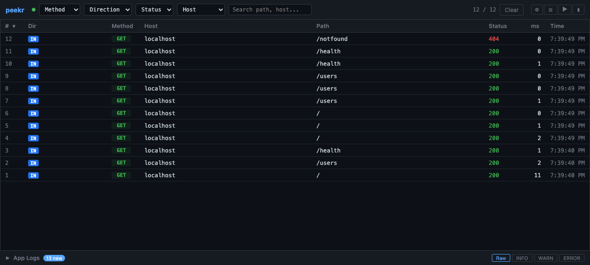
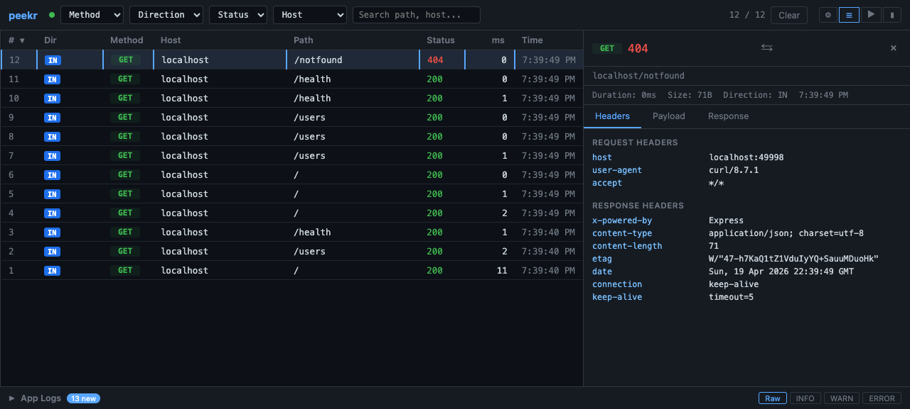
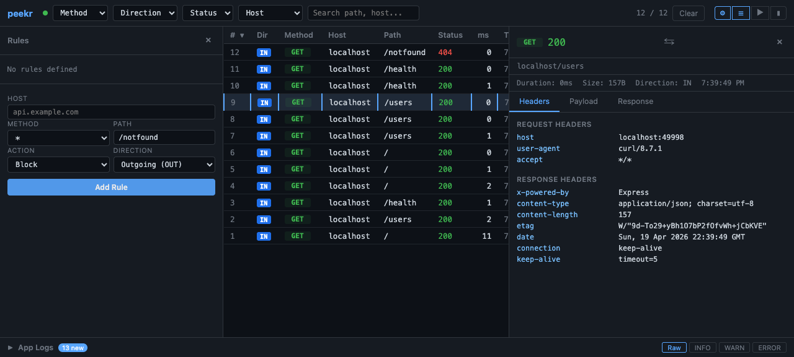
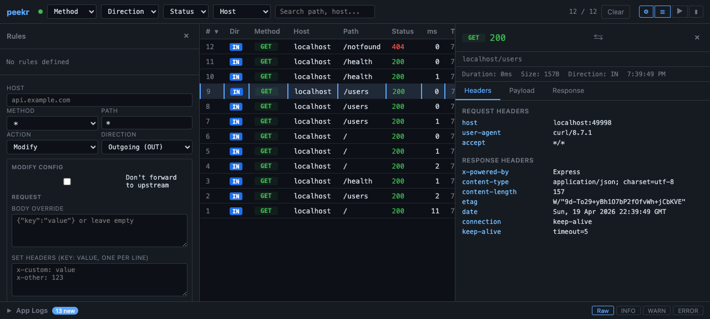

# Dashboard UI

The peekr dashboard is a real-time web interface for inspecting HTTP traffic flowing through the proxy. Launch it with:

```bash
peekr ui -- npm run start:dev
```

Then open [http://localhost:49997](http://localhost:49997) in your browser (port can be customized with `--ui-port`).



## Traffic Flow

```
Client Request
      |
      v
+------------------+       SSE: request event
|   peekr proxy    | --------------------------> [ Dashboard ]
+------------------+                              (browser)
      |
      v
  Upstream Server
```

Every request that passes through peekr is captured and streamed to the dashboard via Server-Sent Events (SSE). When you first open the dashboard, buffered requests are replayed so you immediately see recent traffic.

## Layout Overview

The dashboard uses a 3-panel CSS Grid layout:

| Area | Position | Purpose |
|------|----------|---------|
| Top bar | Top | Filter controls and drawer toggles |
| Request table | Center | Scrollable list of captured requests |
| Detail drawer | Right | Headers, payload, and response inspection |
| Rules drawer | Left | Active rules list and rule creation form |
| Breakpoints panel | Right overlay | Pending breakpoints awaiting manual resume |
| Log drawer | Bottom | Child process stdout/stderr output |

## Top Bar Filters

The top bar provides several controls to narrow down displayed traffic:

- **Method** -- Dropdown to filter by HTTP method (GET, POST, PUT, DELETE, etc.).
- **Direction** -- Toggle between **IN** (incoming via reverse proxy) and **OUT** (outgoing intercepted calls).
- **Status** -- Dropdown to filter by response status code range (2xx, 3xx, 4xx, 5xx).
- **Host** -- Dropdown populated from captured traffic to filter by hostname.
- **Search** -- Free-text input that matches against host and path.

Filters combine with AND logic — only requests matching all active filters are shown.

### Drawer Toggles

Icon buttons on the right side of the top bar control drawer visibility:

| Icon | Drawer |
|------|--------|
| ⚙ (Gear) | Rules drawer (left) |
| ☰ (Hamburger) | Log drawer (bottom) |
| ▶ (Play) | Detail drawer (right) |
| ▮ (Pause) | Breakpoints panel |

## Request Table

The main area displays a table of captured requests with the following columns:

| Column | Description |
|--------|-------------|
| **#** | Sequential request number |
| **Dir** | `IN` or `OUT` badge |
| **Method** | HTTP method (GET, POST, etc.) |
| **Host** | Target hostname |
| **Path** | Request path |
| **Status** | HTTP response status code |
| **ms** | Round-trip time in milliseconds |
| **Time** | Wall-clock time of the request |

**Sorting** -- Click any column header to sort by that column. Click again to reverse the sort order.

**Selecting** -- Click a row to open the detail drawer with full request/response information.

### Rule Match Badges

Some rows display colored badges indicating rule matches:

- **BLK** (red) -- The request matched a **block** rule and was rejected with a `403` response.
- **MOD** (blue) -- The request matched a **modify** rule; headers or body were mutated.
- **BP** (yellow) -- The request matched a **breakpoint** rule and was paused for inspection.

## Detail Drawer

Click any request row to open the right-side detail drawer. It has three size states, cycled by clicking the toggle button (▶):

1. **Collapsed** -- Hidden.
2. **Medium** -- Approximately 40% of the viewport width.
3. **Expanded** -- Approximately 65% of the viewport width.



### Tabs

| Tab | Content |
|-----|---------|
| **Headers** | Request and response headers displayed as key-value pairs |
| **Payload** | Request body (form data, JSON, etc.) |
| **Response** | Response body with JSON syntax highlighting |

JSON bodies are automatically syntax-highlighted using CSS-only regex tokenization — no external libraries required.

## Breakpoints Panel

When a breakpoint rule is active and a matching request arrives, it is paused and appears in the breakpoints panel. Open it with the ▮ button in the top bar.

Each pending breakpoint shows:
- The request method, host, path, and phase (`request` or `response`)
- Full headers and body at the pause point
- **Resume** button — forwards the request (with any edits applied)
- **Abort** button — cancels the request with a `503` response

Breakpoints are resolved via `POST /api/breakpoints/:id/resolve`. See the [Rules Engine guide](guides/rules-engine.md) for the API details.

## Log Drawer

The bottom drawer shows stdout and stderr output from child processes managed by peekr. It has three fixed height states:

1. **Collapsed** -- Thin bar, no content visible.
2. **Medium** -- Approximately 200px tall.
3. **Expanded** -- Approximately 400px tall.

### Log Level Filtering

Four filter buttons control which log lines are displayed:

| Button | Shows |
|--------|-------|
| **Raw** | All raw output (unfiltered) |
| **INFO** | Informational messages only |
| **WARN** | Warnings only |
| **ERROR** | Errors only |

ANSI escape codes are automatically stripped before filtering and display.

## Context Menu

Right-click any request row to open a context menu with options:

- **Block this host** -- Creates a block rule for the request's host. Future requests to that host will receive a `403 Forbidden` response.
- **Modify this host** -- Creates a modify rule for the request's host. Opens the rules drawer to configure request/response mutations.

Both actions create rules via `POST /api/rules`. See the [Rules Engine guide](guides/rules-engine.md) for details on how rules work.

## Rules Drawer

Click the ⚙ gear icon to open the rules drawer on the left side. The drawer shows all active rules and a form to create new ones.



### Rule Form

The form accepts:
- **Host** — hostname to match (pre-filled from context menu)
- **Method** — HTTP method or `*` for all
- **Path** — path prefix
- **Direction** — Incoming (IN), Outgoing (OUT), or both
- **Action** — Block, Modify, or Breakpoint
- For **Modify**: request/response body and header fields
- For **Breakpoint**: phase selector (request / response / both)



## Real-Time Updates

The dashboard maintains an SSE connection to the proxy server. Named event types keep the UI in sync:

| Event | Purpose |
|-------|---------|
| `request` | New request captured — adds a row to the table |
| `app-log` | Child process log output — appends to the log drawer |
| `rules-change` | Rule created or deleted — refreshes the rules drawer |
| `breakpoint` | New breakpoint paused — adds to the breakpoints panel |

If the connection drops, the dashboard reconnects automatically. On reconnect, buffered events are replayed to fill any gaps.
