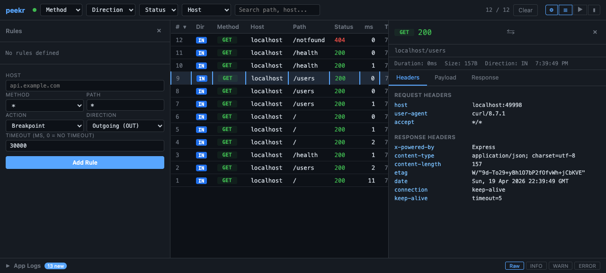

# Rules Engine

The rules engine lets you intercept requests passing through peekr and **block**, **modify**, or **pause (breakpoint)** them — without touching the upstream server.

Rules are evaluated in memory and take effect immediately. No restart required.

## What Rules Do

| Action | Behavior |
|--------|----------|
| **Block** | Returns `403 Forbidden` to the client. The request never reaches the upstream server. |
| **Modify** | Mutates request and/or response headers and body before forwarding/returning. The upstream server is still contacted (unless `noForward` is set). |
| **Breakpoint** | Pauses the request at a configured phase so you can inspect and manually resume it from the dashboard. |

## Rule Fields

Each rule has the following fields:

| Field | Required | Description |
|-------|----------|-------------|
| `host` | Yes | Exact hostname to match (e.g. `api.example.com`) |
| `method` | Yes | HTTP method to match, or `*` for all methods |
| `path` | Yes | Path prefix to match (e.g. `/api/v1` matches `/api/v1/users`) |
| `action` | Yes | `"block"`, `"modify"`, or `"breakpoint"` |
| `direction` | No | `"IN"` (incoming), `"OUT"` (outgoing), or omit to match both |
| `modifyConfig` | Only for modify | Object describing mutations to apply to the request/response |
| `phase` | Only for breakpoint | `"request"`, `"response"`, or `"both"` — when to pause |

### Modify Config

`modifyConfig` describes what to change before forwarding (request side) and before returning (response side):

```json
{
  "req": {
    "setBody": "{\"patched\": true}",
    "setHeaders": { "x-custom": "value" },
    "removeHeaders": ["authorization"]
  },
  "res": {
    "setBody": "{\"mocked\": true}",
    "setHeaders": { "x-injected": "1" },
    "removeHeaders": ["set-cookie"]
  },
  "noForward": false
}
```

All fields within `req` and `res` are optional. Set `noForward: true` to skip the upstream entirely and return the modified (or empty) response directly.

!!! note "Header key normalization"
    Incoming header keys are normalized to lowercase before matching. Use lowercase keys in `setHeaders` and `removeHeaders`.

## Matching Logic

When a request arrives, peekr evaluates rules in order. The **first match wins**:

1. **Host** -- Exact match against the request's hostname.
2. **Method** -- Exact match, or `*` matches any method.
3. **Path** -- Prefix match. Rule path `/api` matches request paths `/api`, `/api/users`, `/api/v1/data`, etc.
4. **Direction** -- If set, only matches `IN` (reverse proxy) or `OUT` (outgoing proxy) traffic.

If no rule matches, the request is forwarded to the upstream server normally.

## Creating Rules

### From the Context Menu

The fastest way to create a rule:

1. Right-click a request row in the dashboard.
2. Select **Block this host** or **Modify this host**.
3. The rule is created immediately. For modify rules, the rules drawer opens so you can configure the mutations.

### From the Rules Drawer

For full control over rule parameters:

1. Click the gear icon (⚙) in the top bar to open the rules drawer.
2. Fill in the form fields: host, method, path, action, direction.
3. For **Modify** rules, fill in the request/response mutation fields.
4. For **Breakpoint** rules, select the phase to pause at.
5. Click **Add Rule** to create it.


### From the API

Use the REST API for programmatic rule management. See [API Endpoints](#api-endpoints) below.

## Breakpoints

Breakpoint rules pause a request at a configured phase. While paused:

- The request is held and does **not** reach the upstream server (if paused at `request` phase).
- The breakpoints panel in the dashboard shows all pending pauses.
- You can inspect headers and body, edit them, and click **Resume** to continue.
- If you click **Abort**, the request is cancelled with a `503` response.



## Managing Rules

Open the rules drawer (gear ⚙ icon) to see all active rules. Each rule card displays its host, method, path, action, and direction. Click the **×** button on a rule card to delete it.

When rules change (created or deleted), the dashboard receives a `rules-change` SSE event and refreshes the list automatically.

## API Endpoints

All API endpoints are served from the dashboard port (default `49997`).

### List All Rules

```bash
curl http://localhost:49997/api/rules
```

Returns a JSON array of all active rules.

### Create a Rule

**Block rule:**

```bash
curl -X POST http://localhost:49997/api/rules \
  -H "Content-Type: application/json" \
  -d '{
    "host": "ads.tracker.com",
    "method": "*",
    "path": "/",
    "action": "block"
  }'
```

**Modify rule (inject a request header):**

```bash
curl -X POST http://localhost:49997/api/rules \
  -H "Content-Type: application/json" \
  -d '{
    "host": "api.example.com",
    "method": "GET",
    "path": "/api/v1/users",
    "action": "modify",
    "direction": "OUT",
    "modifyConfig": {
      "req": {
        "setHeaders": { "x-debug": "true" }
      }
    }
  }'
```

**Modify rule (mock response, no forward):**

```bash
curl -X POST http://localhost:49997/api/rules \
  -H "Content-Type: application/json" \
  -d '{
    "host": "api.example.com",
    "method": "GET",
    "path": "/api/v1/config",
    "action": "modify",
    "modifyConfig": {
      "noForward": true,
      "res": {
        "setBody": "{\"feature_flags\": {\"new_ui\": true}}",
        "setHeaders": { "content-type": "application/json" }
      }
    }
  }'
```

**Breakpoint rule:**

```bash
curl -X POST http://localhost:49997/api/rules \
  -H "Content-Type: application/json" \
  -d '{
    "host": "api.example.com",
    "method": "*",
    "path": "/checkout",
    "action": "breakpoint",
    "phase": "request"
  }'
```

### Delete a Rule

```bash
curl -X DELETE http://localhost:49997/api/rules/RULE_ID
```

Replace `RULE_ID` with the rule's `id` from the list response.

### Resolve a Breakpoint

```bash
curl -X POST http://localhost:49997/api/breakpoints/BREAKPOINT_ID/resolve \
  -H "Content-Type: application/json" \
  -d '{ "action": "resume" }'
```

Use `"action": "abort"` to cancel the request instead.

## Example Workflows

### Block a Noisy Endpoint

During development, a third-party analytics endpoint floods your traffic view:

1. Spot a request to `analytics.vendor.com` in the dashboard.
2. Right-click the row and select **Block this host**.
3. All future requests to `analytics.vendor.com` return `403` and show a red **BLK** badge.

Your traffic view is now clean, and the upstream analytics service receives no data.

### Mock an Unavailable Service

A backend service you depend on is down, but you need to keep developing:

1. Open the rules drawer (gear ⚙ icon).
2. Create a modify rule with `noForward: true`:
   - **Host:** `api.backend.com`
   - **Method:** `GET`
   - **Path:** `/api/v1/config`
   - **Action:** Modify
   - **Res setBody:** `{"feature_flags": {"new_ui": true}}`
   - **Res setHeaders:** `content-type: application/json`
3. Your application now receives the mocked config response, and matched requests show a **MOD** badge.

When the real service comes back, delete the rule and traffic flows normally again.

### Inject Auth Headers Upstream

You need all outgoing requests to include a debug header without changing your app code:

1. Open the rules drawer and create a modify rule:
   - **Host:** `api.example.com`
   - **Method:** `*`
   - **Path:** `/`
   - **Direction:** Outgoing (OUT)
   - **Action:** Modify
   - **Req setHeaders:** `x-internal-debug: 1`
2. Every outgoing request to that host will carry the injected header.

### Pause and Inspect a Checkout Request

You want to inspect (and optionally edit) a checkout payload before it hits your payment service:

1. Create a breakpoint rule for `POST /checkout` on `payments.example.com`.
2. Trigger a checkout in your app.
3. The request pauses — the breakpoints panel shows the pending request with full headers and body.
4. Inspect the payload, optionally edit it, then click **Resume**.
5. The request continues to the payment service with your edits applied.
